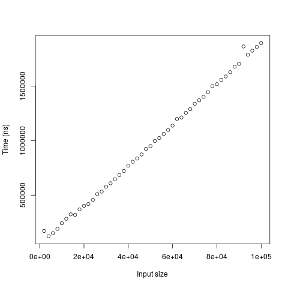
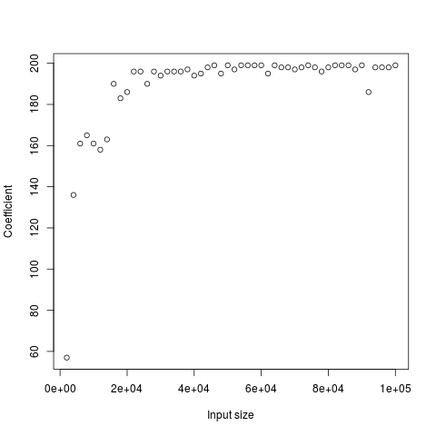

# Yksikkötestaus
Yksikkötestaukseen käytän jUnitia. DES:n testidata on lähtöisin 
[tästä](http://page.math.tu-berlin.de/~kant/teaching/hess/krypto-ws2006/des.htm)
 materiaalista.
 * [Yksikkötestauksen kattavuusraportti](pit-reports/201706220955/index.html)

# Suorituskykytestaus
## Käyttöohje
Suorituskykytestaukseen on main-paketissa oma luokka, Benchmarking. Sen sisältämä
main-metodi mittaa ECB-DES:n suorittamiseen kuluvaa aikaa eri pituisilla syötteillä.
Argumentteja on kolme, pienin testattavan syötteen koko, suurimman testattavan syötteen
koko ja koon lisäys. Testisyötteen koko kasvaa lineaarisesti pienimmästä suurimpaan
annetuin askelin. Esim "100 1000 100" tuottaa syötteiden pituuksiksi 100, 200, 300,
400, 500, 600, 700, 800, 900, 1000.

## Testauksen toteutus
Ensin algoritmit ajetaan yhden kerran pienellä syötteellä, jotta ohjelma on varmasti
käännetty kokonaisuudessaan testausta varten. Seuraavaksi luodaan syötteet annettujen
argumenttien perusteella. Syötteet ovat byte[] tyyppisiä taulukoita, joiden alkiot
ovat kokonaislukuja (int) 1..n-1 muutettuna byte-tyyppisiksi, missä n on syötteen pituus. 

Jokaiselle syötteelle tehdään 10 kertaa seuraava:
1. Otetaan muistiin ensimmäinen aikaleima
2. Annetaan syöte algroritmille
3. Otetaan muistiin toinen aikaleima
4. Tallennetaan aikaleimojen välinen erotus listaan

Näin voidaan ottaa keskiarvo ajoajoista. Testaustulokset tulostuvat stdout:n.
Niitä voi tarkastella helposti esim. R-projektin avulla tallentamalla ne tekstitiedostoon
ja lukemalla komennolla read.table("tiedostonimi").
Graafinen esitys testituloksista argumentein 2000 100000 2000:

__Tämä toteutus__

__Javax:n oletustoteutus__

__Ajoaikojen suhde__

Algoritmi vaikuttaa toimivan ajassa O(n). Tosin selvästi hitaammin kuin javax:n
oletustoteutus. Suurilla syötteillä ero on noin 200-kertainen. Epäilen, että ero
johtuu suureksi osaksi taulukoiden luomisen ja kopioimisen suuresta määrästä.

# Optimointi
## DES
### Siirretty round-metodin koodi process-metodin sisälle
DES-luokassa oli aluksi metodi, joka kuvasi yhtä salauskierrosta. Siirsin sen 
toiminnallisuuden suoraan process-metodin osaksi. Tällä muutoksella oli suuri vaikutus:
 toteutuksen aikavaativuus javax:n oletustoteutukseen
nähden putosi 250-kertaisesta 200-kertaiseen. 

### Substitution boxit byte[][][] -tyyppiseen oliomuuttujaan
Ennen DES-luokassa oli metodi, joka palautti uuden s-boxin syötteenä saamansa
numeron perusteella. Nyt ne luodaan vain yhden kerran samalla kun DES-olio luodaan.
Suhteellinen ajoaika pieneni 200-kertaisesta 180-kertaiseen.

### BitFunctions-luokkaan uusi metodi inPlaceBitwiseXOR
DES:n metodissa feistelFunction saatiin vähennettyä yksi taulukon luominen tällä tavoin.
Suhteellinen ajoaika pieneni 180 -> 170.
