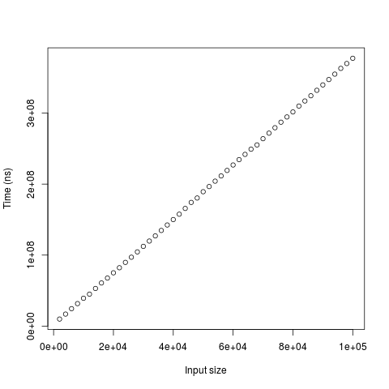

# Yksikkötestaus
Yksikkötestaukseen käytän jUnitia. DES:n testidata on lähtöisin 
[tästä](http://page.math.tu-berlin.de/~kant/teaching/hess/krypto-ws2006/des.htm)
 materiaalista.

# Suorituskykytestaus
Suorituskykytestaukseen on main-paketissa oma luokka, Benchmarking. Sen sisältämä
main-metodi mittaa ECB-DES:n suorittamiseen kuluvaa aikaa eri pituisilla syötteillä.
Argumentteja on kolme, pienin testattavan syötteen koko, suurimman testattavan syötteen
koko ja koon lisäys. Testisyötteen koko kasvaa lineaarisesti pienimmästä suurimpaan
annetuin askelin. Esim "100 1000 100" tuottaa syötteiden pituuksiksi 100, 200, 300,
400, 500, 600, 700, 800, 900, 1000.

Testaustulokset tulostuvat stdout:n. Testaaja sai seuraavat tulokset argumentein
2000 100000 2000:

__Tämä toteutus__

__Javax:n oletustoteutus__

__Ajoaikojen suhde__

Algoritmi vaikuttaa toimivan ajassa O(n). Tosin selvästi hitaammin kuin javax:n
oletustoteutus. Suurilla syötteillä ero on noin 250-kertainen.

# Optimointi
## DES
### Siirretty round-metdoin koodi process-metodin sisälle
Tällä muutoksella oli suuri vaikutus: toteutuksen aikavaativuus javax:n oletustoteutukseen
nähden putosi 250-kertaisesta 200-kertaiseen. 